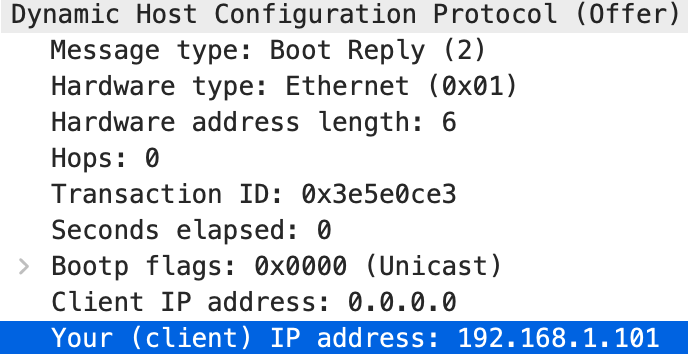

> **Not using an windows machine, so the operations below is skipped and I'll use the *dhcp-ethereal-trace-1* for answering the questions**
>
> 1. Begin by opening the Windows Command Prompt application (which can be found in your Accessories folder). As shown in Figure 1, enter  “*ipconfig /release*”. The executable for *ipconfig* is in C:\windows\system32. This command releases your current IP address, so that your host’s IP address becomes 0.0.0.0.
> 2. Start up the Wireshark packet sniffer, as described in the introductory Wireshark lab and begin Wireshark packet capture.
> 3. Now go back to the Windows Command Prompt and enter “*ipconfig /renew*”. This instructs your host to obtain a network configuration, including a new IP address. In Figure 1, the host obtains the IP address 192.168.1.108
> 4. Wait until the “*ipconfig /renew*” has terminated. Then enter the same command “*ipconfig /renew*” again.
> 5. When the second *“ipconfig /renew”* terminates, enter the command “ipconfig/release” to release the previously-allocated IP address to your computer.
> 6. Finally, enter “*ipconfig /renew*” to again be allocated an IP address for your computer.
> 7. Stop Wireshark packet capture.

1. **Are DHCP messages sent over UDP or TCP?**

   - UDP

     

2. **Draw a timing datagram illustrating the sequence of the first four-packet Discover/Offer/Request/ACK DHCP exchange between the client and server. For each packet, indicated the source and destination port numbers. Are the port numbers the same as in the example given in this lab assignment?**

   

3. **What is the link-layer (e.g., Ethernet) address of your host?**

   - 00:08:74:4f:36:23

     

4. **What values in the DHCP discover message differentiate this message from the DHCP request message?**

   - Option field

     

5. **What is the value of the Transaction-ID in each of the first four (Discover/Offer/Request/ACK) DHCP messages? What are the values of the Transaction-ID in the second set (Request/ACK) set of DHCP messages? What is the purpose of the Transaction-ID field?**

   - 0x3e5e0ce3 (all of them are the same)

   - 0x257e55a3 (all of them are the same)

     

   - Identify the transaction of DHCP requests

6. **A host uses DHCP to obtain an IP address, among other things. But a host’s IP address is not confirmed until the end of the four-message exchange! If the IP address is not set until the end of the four-message exchange, then what values are used in the IP datagrams in the four-message exchange? For each of the four DHCP messages (Discover/Offer/Request/ACK DHCP), indicate the source and destination IP addresses that are carried in the encapsulating IP datagram.**

   - 0.0.0.0 will be used
   - Discover 0.0.0.0➡️255.255.255.255
   - Offer 192.168.1.1➡️255.255.255.255
   - Request 0.0.0.0➡️255.255.255.255
   - ACK 192.168.1.1➡️255.255.255.255

7. **What is the IP address of your DHCP server?**

   - 192.168.1.1

8. **What IP address is the DHCP server offering to your host in the DHCP Offer message? Indicate which DHCP message contains the offered DHCP address.**

   - 192.168.1.101

   - Offer message

     

9. **In the example screenshot in this assignment, there is no relay agent between the host and the DHCP server. What values in the trace indicate the absence of a relay agent? Is there a relay agent in your experiment? If so what is the IP address of the agent?**

   - Relay agent IP address: 0.0.0.0

     

   - Skipped

10. **Explain the purpose of the router and subnet mask lines in the DHCP offer message.**

    - The router line indicates to the client what its default gateway should be. The subnet mask line tells the client which subnet mask it should use.

11. **In the DHCP trace file noted in footnote 2, the DHCP server offers a specific IP address to the client (see also question 8. above). In the client’s response to the first server OFFER message, does the client accept this IP address? Where in the client’s RESPONSE is the client’s requested address?**

    - Yes

      

12. **Explain the purpose of the lease time. How long is the lease time in your experiment?**

    - Indicates how long can the client use this IP

    - 86400s (1 day)

      

13. **What is the purpose of the DHCP release message? Does the DHCP server issue an acknowledgment of receipt of the client’s DHCP request? What would happen if the client’s DHCP release message is lost?**

    - Tell the server that the client won't use this IP anymore so the IP can be assigned to another client
    - No
    - Then the IP is not released in the view of server, but when the lease time is up, it will be released

14. **Clear the *bootp* filter from your Wireshark window. Were any ARP packets sent or received during the DHCP packet-exchange period? If so, explain the purpose of those ARP packets.**

    - Yes
    - DHCP server use ARP to find if the IP it want to assign is occupied already