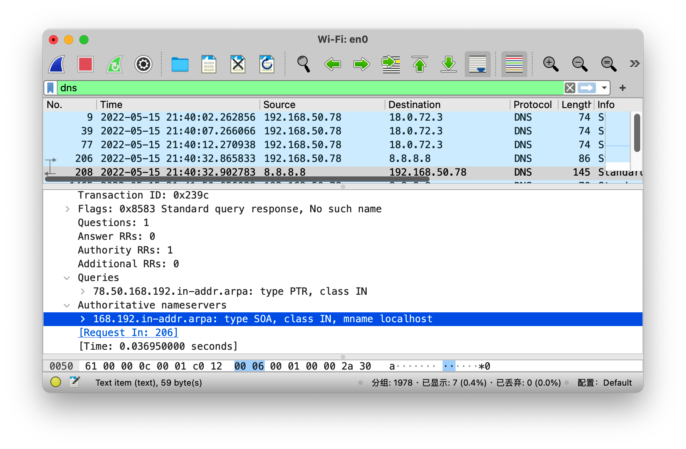

### 1. nslookup

1. **Run *nslookup* to obtain the IP address of a Web server in Asia. What is the IP address of that server?**

   ```
   > nslookup www.google.com.hk
   Non-authoritative answer:
   Name:	www.google.com.hk
   Address: 74.86.17.48
   ```

2. **Run *nslookup* to determine the authoritative DNS servers for a university in Europe.**

   ```
   > nslookup -type=NS cam.ac.uk
   Server:		8.8.8.8
   Address:	8.8.8.8#53
   
   Non-authoritative answer:
   cam.ac.uk	nameserver = auth0.dns.cam.ac.uk.
   cam.ac.uk	nameserver = ns3.mythic-beasts.com.
   cam.ac.uk	nameserver = dns0.eng.cam.ac.uk.
   cam.ac.uk	nameserver = ns2.ic.ac.uk.
   cam.ac.uk	nameserver = dns0.cl.cam.ac.uk.
   cam.ac.uk	nameserver = ns1.mythic-beasts.com.
   
   Authoritative answers can be found from:
   ns1.mythic-beasts.com	has AAAA address 2600:3c00:e000:19::1
   ns2.ic.ac.uk	has AAAA address 2a0c:5bc0:4:1::82
   ns3.mythic-beasts.com	has AAAA address 2a02:2770:11:0:21a:4aff:febe:759b
   dns0.cl.cam.ac.uk	has AAAA address 2a05:b400:110::d:a0
   dns0.cl.cam.ac.uk	has AAAA address 2001:630:212:200::d:a0
   auth0.dns.cam.ac.uk	has AAAA address 2001:630:212:8::d:a0
   ns1.mythic-beasts.com	internet address = 45.33.127.156
   ns2.ic.ac.uk	internet address = 155.198.142.82
   ns3.mythic-beasts.com	internet address = 185.24.221.32
   dns0.cl.cam.ac.uk	internet address = 128.232.0.19
   dns0.eng.cam.ac.uk	internet address = 129.169.8.8
   auth0.dns.cam.ac.uk	internet address = 131.111.8.37
   ```

3. **Run *nslookup* so that one of the DNS servers obtained in Question 2 is queried for the mail servers for Yahoo! mail. What is its IP address?**

   Failed

   ```
   > nslookup auth0.dns.cam.ac.uk mail.yahoo.com
   ;; connection timed out; no servers could be reached
   ```

### 3. Tracing DNS with Wireshark

4. **Locate the DNS query and response messages. Are then sent over UDP or TCP?**

   UDP

   

5. **What is the destination port for the DNS query message? What is the source port of DNS response message?**

   - 53
   - 20895

6. **To what IP address is the DNS query message sent? Use ipconfig to determine the IP address of your local DNS server. Are these two IP addresses the same?**

   - 8.8.8.8 (configed manually)

7. **Examine the DNS query message. What “Type” of DNS query is it? Does the query message contain any “answers”?**

   - A
   - No

8. **Examine the DNS response message. How many “answers” are provided? What do each of these answers contain?**

   - 3

   

9. **Consider the subsequent TCP SYN packet sent by your host. Does the destination IP address of the SYN packet correspond to any of the IP addresses provided in the DNS response message?**
   - Yes
10. **This web page contains images. Before retrieving each image, does your host issue new DNS queries?**
    - Depends on which server were the images on

11. **What is the destination port for the DNS query message? What is the source port of DNS response message?**

    - 53, 62703

      

12. **To what IP address is the DNS query message sent? Is this the IP address of your default local DNS server?**

    - 8.8.8.8 (configed manually)

13. **Examine the DNS query message. What “Type” of DNS query is it? Does the query message contain any “answers”?**

    - A
    - No

14. **Examine the DNS response message. How many “answers” are provided? What do each of these answers contain?**

    - 3

    

15. **Provide a screenshot.**

16. **To what IP address is the DNS query message sent? Is this the IP address of your default local DNS server?**

    - 8.8.8.8

17. **Examine the DNS query message. What “Type” of DNS query is it? Does the query message contain any “answers”?**

    - A
    - No

18. **Examine the DNS response message. What MIT nameservers does the response message provide? Does this response message also provide the IP addresses of the MIT namesers?**

    

19. **Provide a screenshot.**

20. **To what IP address is the DNS query message sent? Is this the IP address of your default local DNS server?**

    - 8.8.8.8

21. **Examine the DNS query message. What “Type” of DNS query is it? Does the query message contain any “answers”?**

    - A

    - No

22. **Examine the DNS response message. How many “answers” are provided? What does each of these answers contain?**

    - Due to network problem, this DNS query failed, my DNS client finally queried the 8.8.8.8 for answer

    

23. **Provide a screenshot.**

