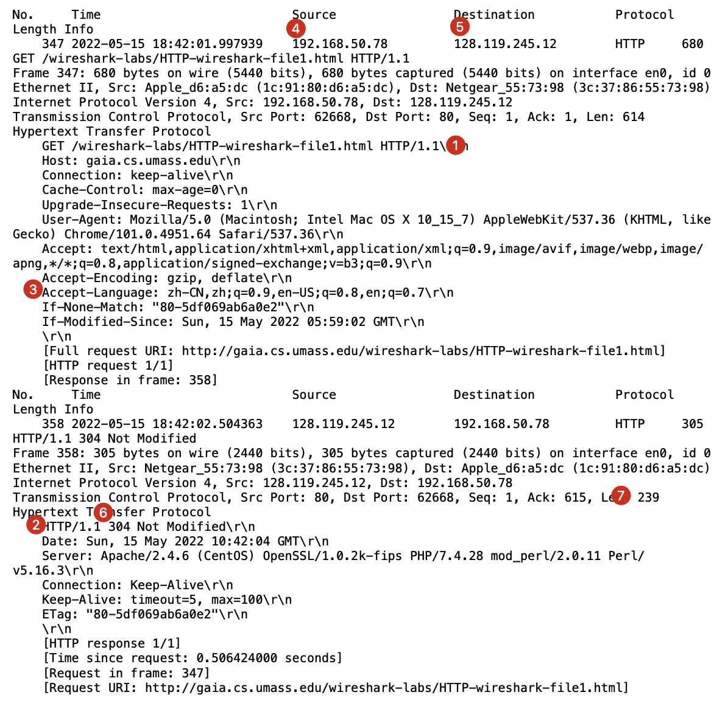
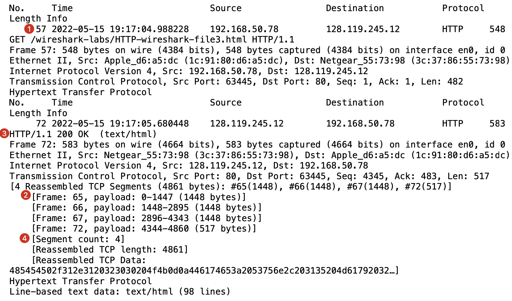

### 1. The Basic HTTP GET/response interaction

> Result below may not be the "correct" answer because I didn't wait enough time to let the server modify this file. But I'm too lazy to do it again.

1. **Is your browser running HTTP version 1.0 or 1.1? What version of HTTP is the server running?**

   1. HTTP/1.1

   2. HTTP/1.1

2. **What languages (if any) does your browser indicate that it can accept to the server?**

   3. zh-CN,zh;q=0.9,en-US;q=0.8,en;q=0.7

3. **What is the IP address of your computer? Of the gaia.cs.umass.edu server?**

   4. 192.168.50.78

   5. 128.119.245.12

4. **What is the status code returned from the server to your browser?**

   6. 304

5. **When was the HTML file that you are retrieving last modified at the server?**

   - No such field because of 304

6. **How many bytes of content are being returned to your browser?** 

   7. 239

7. **By inspecting the raw data in the packet content window, do you see any headers within the data that are not displayed in the packet-listing window? If so, name one.**

   - No

     

### 2. The HTTP CONDITIONAL GET/response interaction

8. **Inspect the contents of the first HTTP GET request from your browser to the server. Do you see an “IF-MODIFIED-SINCE” line in the HTTP GET?**
   - No
9. **Inspect the contents of the server response. Did the server explicitly return the contents of the file? How can you tell?**
   - Yes, it's in the body of the response
10. **Now inspect the contents of the second HTTP GET request from your browser to the server. Do you see an “IF-MODIFIED-SINCE:” line in the HTTP GET? If so, what information follows the “IF-MODIFIED-SINCE:” header?**
    - Yes
    - Value of *Last-Modified* in last response's header
11. **What is the HTTP status code and phrase returned from the server in response to this second HTTP GET? Did the server explicitly return the contents of the file? Explain.**
    - 304 Not Modified
    - No, body of this response is empty. Because the browser already cached the file, there's no need for the server to return the file.

### 3. Retrieving Long Documents

12. **How many HTTP GET request messages did your browser send? Which packet number in the trace contains the GET message for the Bill or Rights?**

    1. 1, 57

13. **Which packet number in the trace contains the status code and phrase associated with the response to the HTTP GET request?**

    2. 65

14. **What is the status code and phrase in the response?**

    3. 200 OK

15. **How many data-containing TCP segments were needed to carry the single HTTP response and the text of the Bill of Rights?**

    4. 4

       

### 4. HTML Documents with Embedded Objects

16. **How many HTTP GET request messages did your browser send? To which Internet addresses were these GET requests sent?**
    - 4
      - 128.119.245.12
      - 128.119.245.12
      - 178.79.137.164
      - 23.74.15.72
17. **Can you tell whether your browser downloaded the two images serially, or whether they were downloaded from the two web sites in parallel? Explain.**
    - Serially, because the GET request was sent after the first PNG file was downloaded

### 5. HTTP Authentication

18. **What is the server’s response (status code and phrase) in response to the initial HTTP GET message from your browser?**

    - 401 Unauthorized

19. **When your browser’s sends the HTTP GET message for the second time, what new field is included in the HTTP GET message?**

    - Authorization field in header with value `Basic d2lyZXNoYXJrLXN0dWRlbnRzOm5ldHdvcms=`

    

