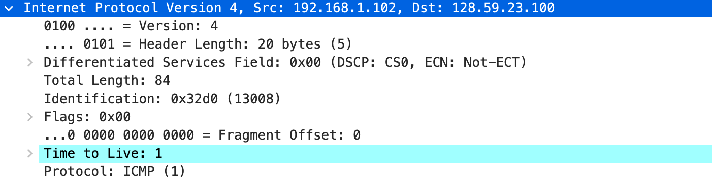
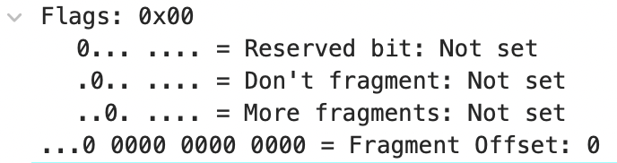
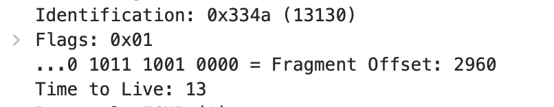
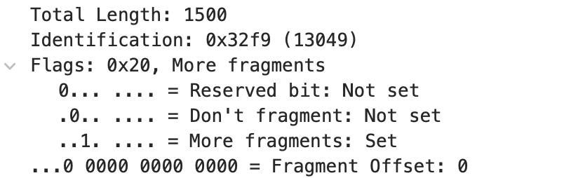

1. **Select the first ICMP Echo Request message sent by your computer, and expand the Internet Protocol part of the packet in the packet details window.**

   - 192.168.1.102

2. **Within the IP packet header, what is the value in the upper layer protocol field?**

   - ICMP(1)

3. **How many bytes are in the IP header? How many bytes are in the payload of the *IP datagram*? Explain how you determined the number of payload bytes.**

   - 20 bytes
   - 64 bytes
   - Total length - Header length

   

4. **Has this IP datagram been fragmented? Explain how you determined whether or not the datagram has been fragmented.**

   - No

   - More Fragments is 0

     

5. **Which fields in the IP datagram *always* change from one datagram to the next within this series of ICMP messages sent by your computer?**

   - TTL, Checksum, Identification

6. **Which fields stay constant? Which of the fields *must* stay constant? Which fields must change? Why?**

   - Constant: Version, Header Length, Service Field, Protocol, Src, Dest
   - Must constant: Version, Header Length, Src, Dest, Service Field, Protocol
   - Must change: Identification, TTL, Checksum

7. **Describe the pattern you see in the values in the Identification field of the IP datagram**

   - Increment one by one with each ICMP echo request

8. **What is the value in the Identification field and the TTL field?**

   - 13130, 13

     

9. **Do these values remain unchanged for all of the ICMP TTL-exceeded replies sent to your computer by the nearest (first hop) router? Why?**

   - All identifications of these segments are 0
   - TTL are the same

10. **Find the first ICMP Echo Request message that was sent by your computer after you changed the *Packet Size* in *pingplotter* to be 2000. Has that message been fragmented across more than one IP datagram?** 

    - Yes, it was fragmented into two IP datagram

11. **Print out the first fragment of the fragmented IP datagram. What information in the IP header indicates that the datagram been fragmented? What information in the IP header indicates whether this is the first fragment versus a latter fragment? How long is this IP datagram?**

    - More fragments flag = 1

    - More fragments flag = 0 ➡️ last. Fragment offset = 0 ➡️ first

    - 1500(including the header)

      

12. **Print out the second fragment of the fragmented IP datagram. What information in the IP header indicates that this is not the first datagram fragment? Are there more fragments? How can you tell?**

    - Fragment offset != 0
    - No more fragments becasuse more fragments bit is 0

13. **What fields change in the IP header between the first and second fragment? **

    - Fragment offset, Flags

14. **How many fragments were created from the original datagram? **

    - 3

15. **What fields change in the IP header among the fragments?**

    - Fragment offset, Flags, Checksum
    - Length(case by case)