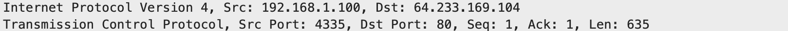
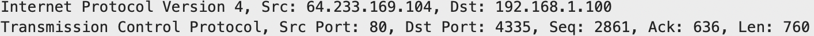

1. **What is the IP address of the client?**

   - 192.168.1.100

2. **The client actually communicates with several different Google servers in order to implement “safe browsing.” (See extra credit section at the end of this lab). The main Google server that will serve up the main Google web page has IP address 64.233.169.104. In order to display only those frames containing HTTP messages that are sent to/from this Google, server, enter the expression “http && ip.addr == 64.233.169.104” (without quotes) into the Filter: field in Wireshark .** 

3. **Consider now the HTTP GET sent from the client to the Google server (whose IP address is IP address 64.233.169.104) at time 7.109267. What are the source and destination IP addresses and TCP source and destination ports on the IP datagram carrying this HTTP GET?**

   - 192.168.1.100:4335➡️64.233.169.104:80

     

4. **At what time is the corresponding 200 OK HTTP message received from the Google server? What are the source and destination IP addresses and TCP source and destination ports on the IP datagram carrying this HTTP 200 OK message?**

   - 7.158797

   - 64.233.169.104:80➡️192.168.1.100:4335

     

5. **Recall that before a GET command can be sent to an HTTP server, TCP must first set up a connection using the three-way SYN/ACK handshake.**

   1. At what time is the client to-server TCP SYN segment sent that sets up the connection used by the GET sent at time 7.109267?

      - 7.075657

        

   2. What are the source and destination IP addresses and source and destination ports for the TCP SYN segment?

      - 192.168.1.100:4335➡️64.233.169.104:80

   3. What are the source and destination IP addresses and source and destination ports of the ACK sent in response to the SYN?

      - 64.233.169.104:80➡️192.168.1.100:4335

        

   4. At what time is this ACK received at the client?

      - 7.108986

6. **In the NAT_ISP_side trace file, find the HTTP GET message was sent from the client to the Google server at time 7.109267 (where t=7.109267 is time at which this was sent as recorded in the NAT_home_side trace file). **

   1. At what time does this message appear in the NAT_ISP_side trace file?

      - 6.069168

        

   2. What are the source and destination IP addresses and TCP source and destination ports on the IP datagram carrying this HTTP GET (as recording in the NAT_ISP_side trace file)?

      - 71.192.34.104:4335➡️64.233.169.104:80

   3. Which of these fields are the same, and which are different, than in your answer to question 3 above?

      - Src IP is different since it will be NAT translated fron LAN to WAN
      - Dest IP, src port and dest port are the same

7. **Are any fields in the HTTP GET message changed? Which of the following fields in the IP datagram carrying the HTTP GET are changed: Version, Header Length, Flags, Checksum. If any of these fields have changed, give a reason (in one sentence) stating why this field needed to change.**

   - No
   - Checksum need to change because the src IP field of IP datagram changes, other fields remain not changed

8. **In the NAT_ISP_side trace file, at what time is the first 200 OK HTTP message received from the Google server? What are the source and destination IP addresses and TCP source and destination ports on the IP datagram carrying this HTTP 200 OK message? Which of these fields are the same, and which are different than your answer to question 4 above?**

   - 6.117570
   - 64.233.169.104:80➡️71.192.34.104:4335
   - Dest IP is different, other field is the same

9. **In the NAT_ISP_side trace file, at what time were the client-to-server TCP SYN segment and the server-to-client TCP ACK segment corresponding to the segments in question 5 above captured? What are the source and destination IP addresses and source and destination ports for these two segments? Which of these fields are the same, and which are different than your answer to question 5 above?**

   - 6.035475, 71.192.34.104:4335➡️64.233.169.104:80
   - 6.067775, 64.233.169.104:80➡️71.192.34.104:4335
   - Time is different, src/dest IP is different (obviously)

10. **Using your answers to 1-8 above, fill in the NAT translation table entries for HTTP connection considered in questions 1-8 above.**

    | WAN                 | LAN                 |
    | ------------------- | ------------------- |
    | 71.192.34.104, 4335 | 192.168.1.100, 4335 |

    